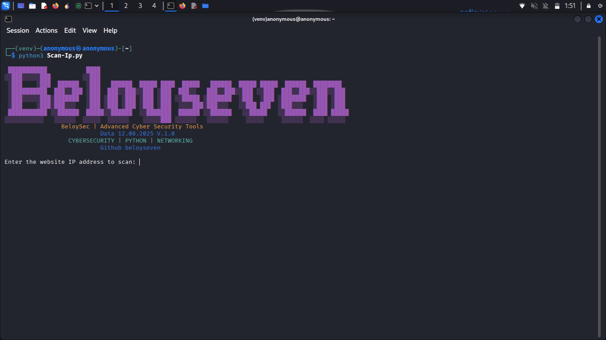

# Scan-Ip

⚠️Warning: project objetives the project looks at the port is opened and closed but where the use of the port scan decreases the illegal project.

 

 # Instalation
  
   
   
   
   
   

   
 
  #### 🐧 Linux (Debian/Ubuntu)🚀

     sudo apt update && sudo apt install python3 python3-pip git -y
     
      git clone https://github.com/beloyseven/Scan-Ip.git

     python3 -m venv venv
    
    source venv/bin/activate

    cd Scan-Ip

    pip install -r requirements.txt

    python3 Scan-Ip.py

#### ⚠️Attention is being used because this is an illegal project whose scan down should be the responsibility of each person, which I did but I did not try.
    Ensure that all dependence is installed. 
    Run the script using Python. 
    Enter the original IP for the langsung scan immediately give the port opening the original.

#### ✍️ created by : beloyseven

#### 🚨 i'm just for a project, you who use it must be responssable, because this is only used illegally.

